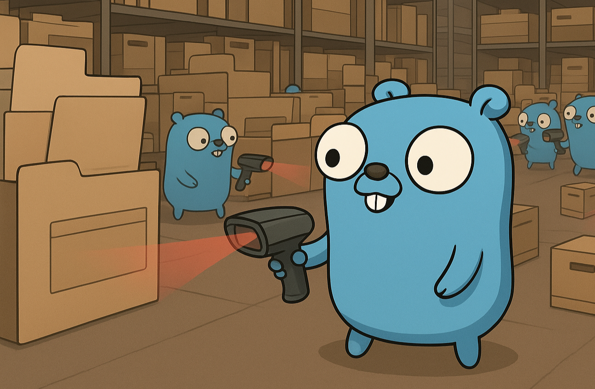

## For what
Calculates the hash of the specified directory using the selected algorithm. Features extensive logging. Generates a resulting file.

1. File integrity check
2. Helps maintain files stored on SDD/HDD by reading them, thereby "updating" the block in which they are stored on the disk.

## How it works
The user selects the required algorithm, specifies the directory, after which the process is launched with visualization (progress bar, number of files and the number of those already processed) -> at the end, the user receives the final hash.